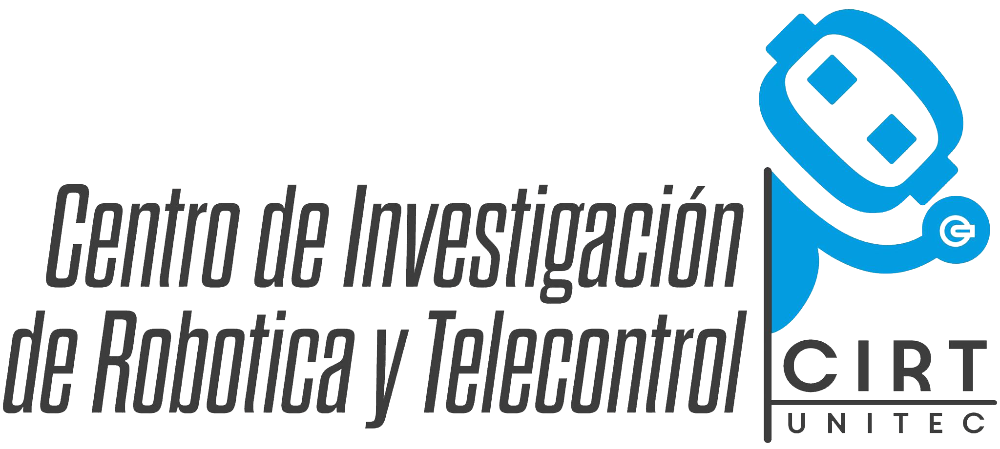

# Proyectos CIRT

Esta es una lista de proyectos para la célula de Desarrollo de Software de CIRT, el cual es un grupo de proyectos que forma parte de la Universidad Tecnológica del Centro (UNITEC), en Venezuela.

Los proyectos que se describen a continuación fueron diseñados para que los integrantes de la célula de este proyecto puedan poner en práctica lo aprendido tanto en clases como en las sesiones de proyecto.
Sin embargo, se invita a los interesados a colaborar agregando nuevos proyectos o mejorando los ya existentes.

## Proyectos disponibles
* [Proyecto #1](./projects/project_1.md) — Blog
* [Proyecto #2](./projects/project_2.md) — Reseña de libros
* [Proyecto #3](./projects/project_3.md) — Clon de Reddit
* [Proyecto #4](./projects/project_4.md) — Tienda de música
* [Proyecto #5](./projects/project_5.md) — Clon de Twitter
* [Proyecto #6](./projects/project_6.md) — Libro de recetas
* [Proyecto #7](./projects/project_7.md) — En desarrollo
* [Proyecto #8](./projects/project_8.md) — En desarrollo
* [Proyecto #9](./projects/project_9.md) — En desarrollo

## Recursos
* [awesome](https://github.com/sindresorhus/awesome) — Lista increíble de listas increíbles para múltiples lenguajes de programación, _frameworks_, plataformas, etc.
* [free-programming-books](https://github.com/vhf/free-programming-books/blob/master/free-programming-books.md) — Lista de libros gratuitos (legalmente) de múltiples lenguajes de programación
* [A Huge List of Koans](https://changelog.com/a-huge-list-of-koans/) — Lista de _Koans_ (acertijos budistas) para múltiples lenguajes de programación, los cuales están enfocados a enseñar la sintaxis y el comportamiento de un lenguaje mediante TDD (_Test-driven development_)
* [Programming, Motherfucker](http://programming-motherfucker.com/) — Manifiesto anti-metodologías de software
* [Hackr.io](https://hackr.io/) — Sitio web que permite encontrar los mejores recursos para el lenguaje de programación/plataforma que selecciones
* [Codeacademy](https://www.codecademy.com/) — Tutoriales gratuitos de desarrollo web
* [Mozilla Developer Network](https://developer.mozilla.org/en-US/) — Santa biblia para todo lo que corresponde a HTML, CSS y JavaScript
* [MarkSheet](http://marksheet.io/) — Tutorial gratuito de HTML y CSS
* [HTML Dog](http://www.htmldog.com/) — Sitio web con tutoriales, técnicas, ejemplos y referencias de HTML, CSS y JavaScript
* [Eloquent JavaScript](http://eloquentjavascript.net/) — Libro gratuito para aprender a programar en JavaScript sin tener experiencia previa programando
* [Learn Ruby The Hard Way](https://learnrubythehardway.org/book/) — Similar al anterior, pero con Ruby
* [The Bastards Book of Ruby](http://ruby.bastardsbook.com/toc/) — Libro gratuito de Ruby que va desde lo más básico del lenguaje hasta lo más avanzado
* [Introduction to the Art of Programming Using Scala (Part I)](https://www.youtube.com/playlist?list=PL0B0820169DCF0AD2) — Video-tutorial de la mano de Mark Lewis que permite aprender a programar en Scala sin previa experiencia programando
* [Introduction to the Art of Programming Using Scala (Part II)](https://www.youtube.com/playlist?list=PLF6CAC63C615DB881) — Segunda parte del video-tutorial de Mark Lewis
* [Reddit's Daily Programmer](https://www.reddit.com/r/DailyProgrammer) — Ejercicios diarios de programación
* [Project Euler](https://projecteuler.net/) — Ejercicios matemáticos de programación
* [Coding Rainbow](https://www.youtube.com/user/shiffman) — Tutoriales de programación creativos y divertidos de la mano de Daniel Shiffman (con Javascript)

## ¿Cómo colaborar?
* Clona este repositorio
* Añade el proyecto que diseñaste o la sugerencia que realizaste sobre algunos de los ya existentes
* Commit!
* Enviame un *pull request*

## Licencia
[MIT](./LICENSE) ♥

## Social
Puedes seguirme en Twitter como [@AITBW](https://twitter.com/AITBW)
